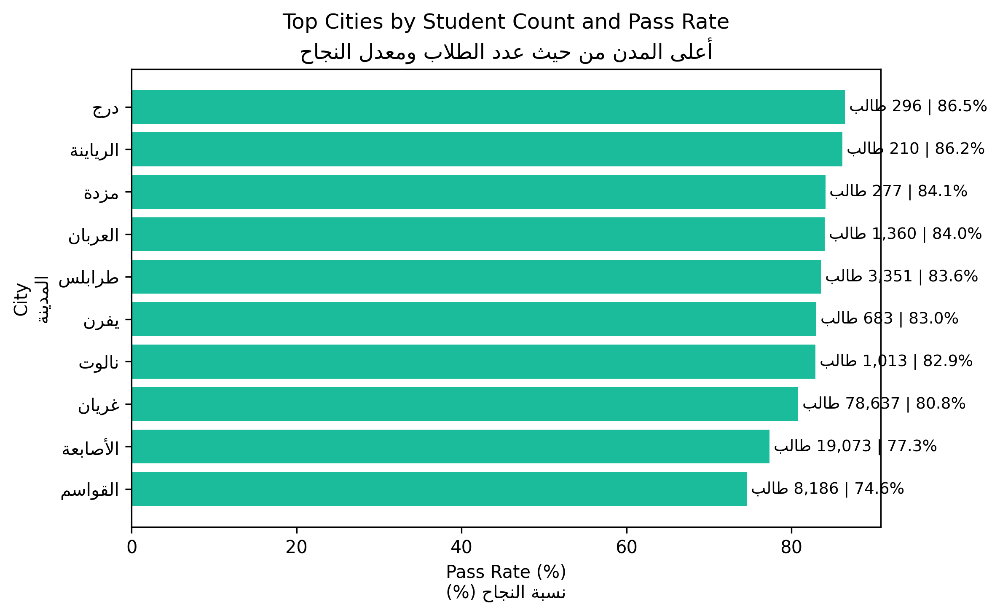
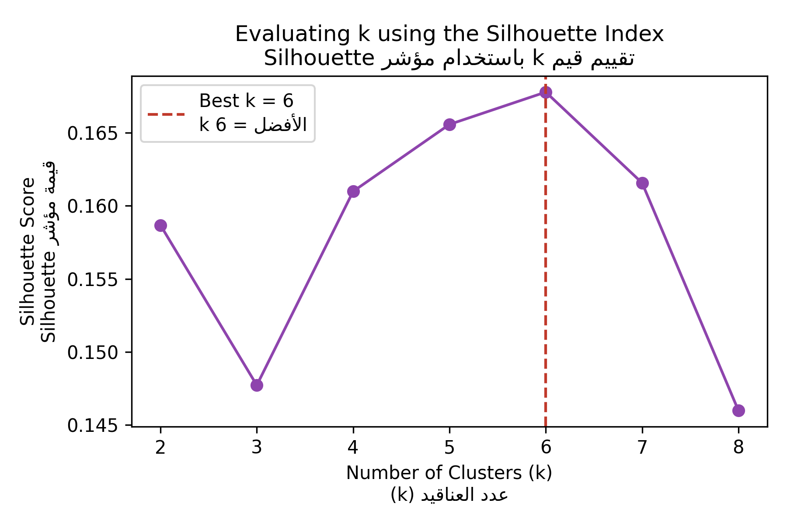
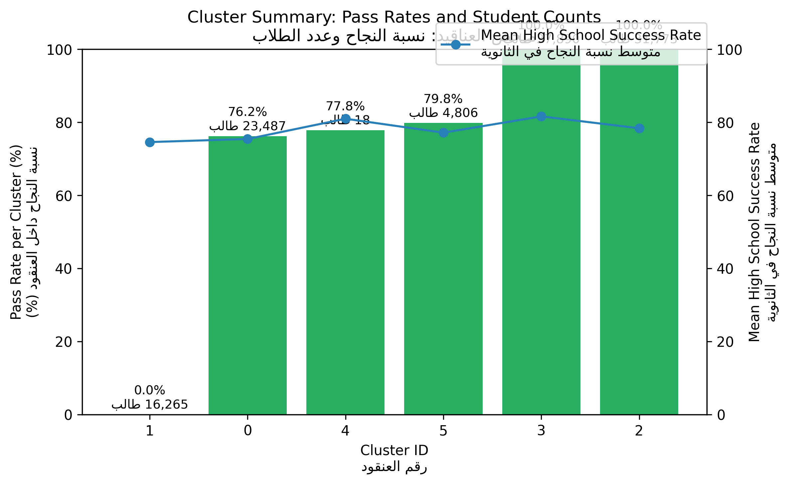
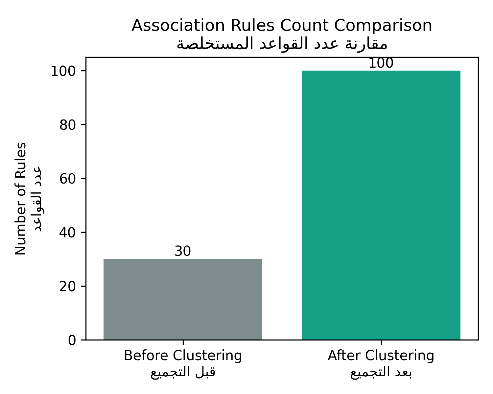
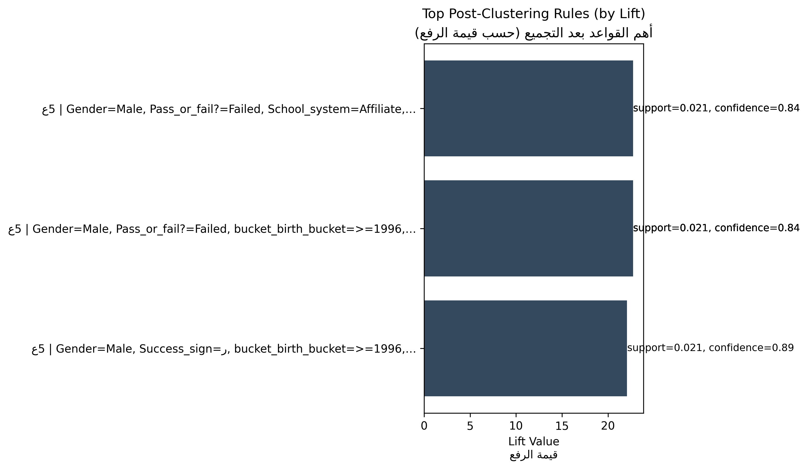

# دراسة استخراج الأنماط وتأثير التجميع على الأداء الأكاديمي

## نظرة عامة على البيانات
- عدد السجلات بعد التنظيف: **114,239 طالبًا**.
- النسبة الكلية للنجاح: **80.0%**.


## أبرز المدن أداءً
يوضح الرسم التالي المدن الأكثر كثافة في قاعدة البيانات مع معدل النجاح لكل مدينة، مما يساعد على تحديد المناطق التي تحتاج إلى تدخل:



## منهجية المعالجة المسبقة
- إزالة التكرارات وتوحيد صياغة القيم النصية.
- تعويض السنة الأكاديمية المفقودة بقيمة “Unknown”.
- إنشاء شرائح زمنية لسنة الميلاد وسنة التسجيل ونسبة النجاح.
- تجهيز البيانات الترميزية لتغذية خوارزمية Apriori والتجميع.

## نتائج Apriori قبل التجميع
- تم استخراج **30 قاعدة** باستخدام دعم أدنى 0.05 وثقة أدنى 0.6.
- أقوى قاعدة قبل التجميع: **Pass_or_fail?=Failed, School_system=regular, bucket_birth_bucket=>=1996, rate_band_success_rate_band=<70 → Secondary_system=High_school, Success_sign=ر, bucket_registration_bucket=>=2015** (الدعم 0.050، الثقة 0.91، الرفع 7.64).

## اختيار عدد العناقيد
تم تقييم قيم k من 2 إلى 8 باستخدام مؤشر Silhouette لتحديد البنية التجميعية الأنسب.



- القيمة المثلى: **k = 6** مع أعلى معامل Silhouette.

## خصائص العناقيد
يظهر الرسم التالي مقارنة نسب النجاح وعدد الطلاب ومتوسط نسبة النجاح في الثانوية لكل عنقود:



## Apriori بعد التجميع
- بعد تقسيم البيانات، تم استخراج **100 قاعدة** أكثر تخصصًا داخل العناقيد.



### أقوى القواعد بعد التجميع
- أقوى قاعدة بعد التجميع (رفع 22.73): عنقود 5 | Gender=Male, Pass_or_fail?=Failed, School_system=Affiliate, bucket_birth_bucket=>=1996, rate_band_success_rate_band=<70 → Secondary_system=High_school, Success_sign=ر, bucket_registration_bucket=>=2015.



## التوصيات العملية
- التركيز على دعم الطلاب في العنقود 1 حيث لا تتجاوز نسبة النجاح 0.0%. أكثر المدن تمثيلاً: غريان.
- دراسة ممارسات العنقود 2 (نسبة نجاح 100.0%) مع التركيز على تخصص Data analysis لنقل الخبرات إلى بقية العناقيد.
- دراسة ممارسات العنقود 3 (نسبة نجاح 100.0%) مع التركيز على تخصص Accounting لنقل الخبرات إلى بقية العناقيد.
- مراقبة الطلاب المسجلين بعد 2015 حيث تصل نسبة الرسوب ضمنهم إلى 21.3%.

## الخلاصة النهائية
- تطبيق التجميع قبل استخراج القواعد أظهر أن الأنماط أصبحت أكثر دقة ومرتبطة بشرائح طلابية محددة، مما يوفر أساسًا أقوى لاتخاذ قرارات موجهة.
- يوصى بتحديث البيانات دوريًا وإعادة تنفيذ التحليل لمراقبة التغيرات واستباق التحديات الأكاديمية.

## كيفية إعادة التنفيذ
```bash
python analysis_pipeline.py
```